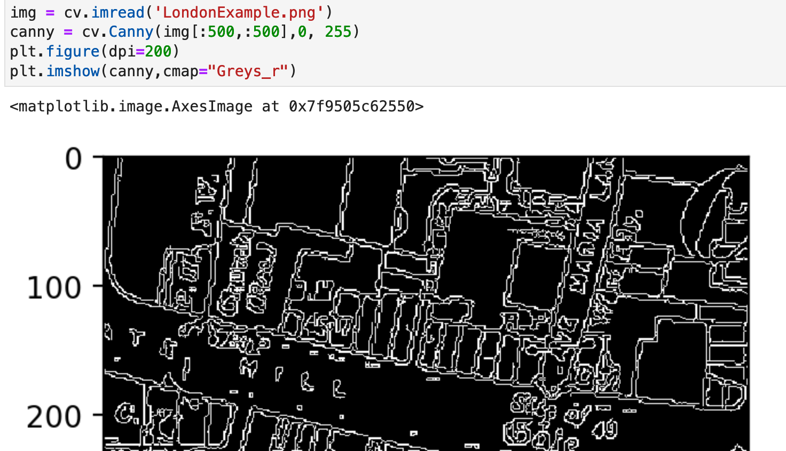

# Maps hack days example notebooks 

This repository contains several notebooks produced as part of the [Living with Machines](livingwithmachines.ac.uk/) (LwM) project for a series of "hack days" on working with maps at scale. 

### Disclaimer!
These notebooks are shared as an artefact of the Living with Machines projects working process and are probably not that directly useful in their current form. We are busy working on outputs based on much of this work which should be available soon. 

## What?
These notebooks were largely produced in preparation for two hack days described in this [blog post](http://livingwithmachines.ac.uk/using-hack-days-to-explore-maps-at-scale). A couple of notebooks show outputs produced during the hack days themselves. 

Both of these hack days had the aim of trying to explore what was possible to do with computer vision and digitised historical maps (at scale).

## Contents 

### Hack day one notebooks
The [first hack day notebooks](https://github.com/Living-with-machines/map-hackdays-example-notebooks/tree/master/hack-day-1), "proof by pixel" focused on "traditional" computer vision methods, as well as covering some basics of working with images in Python. This includes notes on images as 'matrix of numbers', accessing summary stats about images, convolutions, edge detection etc. 

### Hack day two notebooks
The [second hack day notebooks](https://github.com/Living-with-machines/map-hackdays-example-notebooks/tree/master/hack-day-2) focused on developing an approach for "entity detection" for working with historical maps. They also include a broader intro to deep learning, building training sets etc. 

The notebooks and hack days were intended to be part of a learning process which would help us develop evaluate potential research directions in a semi-efficient and moderately enjoyable way. The relative merits of this approach are discussed in the [blog post](http://livingwithmachines.ac.uk/using-hack-days-to-explore-maps-at-scale)

## Authors 
- hack day 1 notebooks: Kaspar Beelen, Daniel van Strien 
- hack day 2 notebooks: Daniel van Strien, Katie McDonough,  Kaspar Beelen
